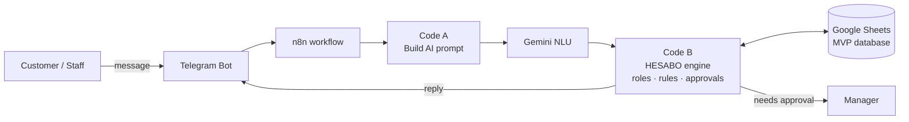

<div align="center">

# 🤖 HESABO — AI Accounting Assistant over Chat
### Ask for balances, invoices, payments and quotations by chatting — Telegram today, WhatsApp next


</div>

---

## 📌 Overview

HESABO is **not a new accounting program** — it is an **AI automation layer** that sits between a chat app and a company's existing accounting data. Customers and staff simply message the bot in Arabic (Egyptian/Gulf dialect) or English:

> *"كام رصيدي؟"* · *"ابعتلي آخر فاتورة"* · *"عايز عرض سعر لقص 4 فتحات"*

The AI understands the intent, checks the sender's **role and permissions**, reads or writes the data, and routes sensitive operations (new invoice, payment, quotation) to a **human approval** step.

## ✨ Features

- 🧠 **AI intent detection** (Gemini) with a **rule-based fallback engine** — keeps working if the AI is unavailable
- 👥 **Roles** — admin, sales, accountant, customer; phone-number linking for customers
- ✅ **Approval workflow** — configurable per operation + amount threshold
- 📒 **Customers, invoices, payments, quotations, leads, hand-offs** stored in Google Sheets (MVP database)
- 🔁 **Follow-ups & overdue reminders**
- 🧪 **Full browser simulator** (`HESABO_Simulator.html`) to test 100+ scenarios before touching real systems
- 🌐 Runs on a local n8n instance exposed via a free **Cloudflare Tunnel**

## 🏗️ Architecture



## 🗺️ Roadmap

`Simulator ✅` → `Free MVP: Telegram + n8n + Sheets + AI ✅` → validation with 100+ scenarios → production backend + **WhatsApp Business Platform** + accounting/ERP API → OCR, voice & AI sales → **SaaS** with subscription tiers.

## 🚀 Try it

- **Simulator:** open `HESABO_Simulator.html` in any browser — no setup.
- **MVP:** import `HESABO_n8n_workflow.json` into n8n, add your Telegram + Google Sheets credentials, set your Sheet ID, load `HESABO_Database.xlsx` (demo data) into Google Sheets, then run `start_hesabo.ps1`.
- Setup guide: **[HESABO_Phase1_Setup_Guide.pdf](HESABO_Phase1_Setup_Guide.pdf)**

## 🗂️ Files

```
engine/HESABO_engine_core.js    shared core (data access, roles, helpers)
engine/HESABO_engine_codeA.js   n8n Code node A — builds the AI prompt
engine/HESABO_engine_codeB.js   n8n Code node B — the decision engine
HESABO_n8n_workflow.json        importable n8n workflow (25 nodes)
HESABO_Simulator.html           standalone simulator
HESABO_Database.xlsx            demo database (fictional data)
```

---

## 👤 Author

**Mahmoud Shahab** — AI Department Manager · AI Automation & Operations
Building AI-powered systems that turn messy operations into clear, trackable workflows.

[](https://www.linkedin.com/in/mahmoud-shahab-ai)
[](https://github.com/ShekoDev)

© Mahmoud Shahab — All rights reserved.
